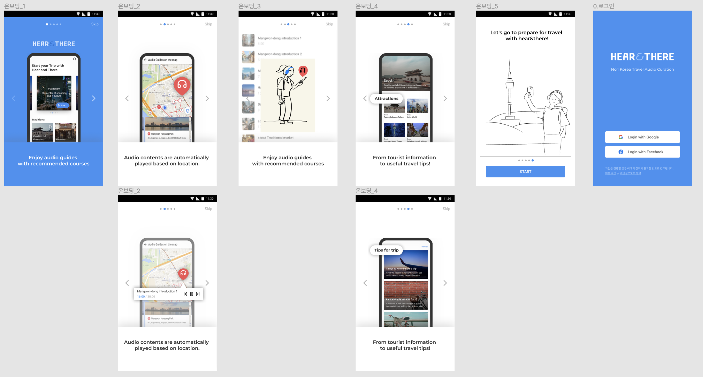
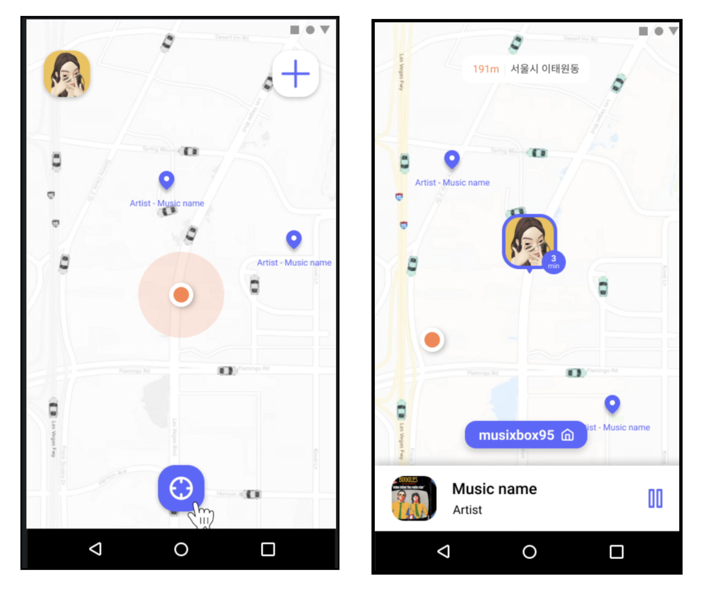
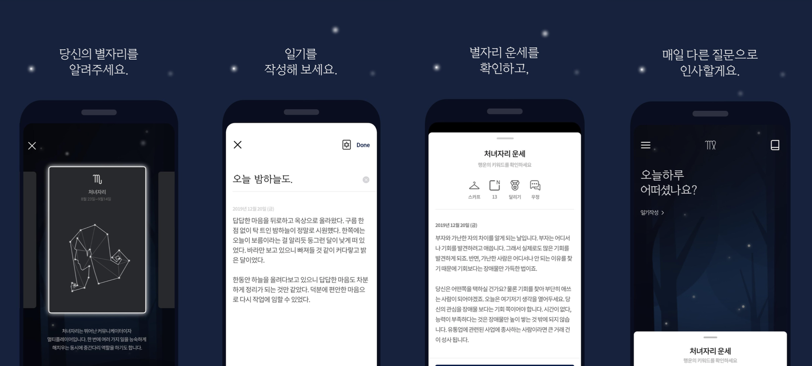

# resume

#### 모두가 똑같은 살 수 있는 세상을 꿈꾸는 개발자입니다. 

앱만큼 사람들의 일상에 영향을 끼칠 수 있는 매체는 없다고 생각합니다. 그렇기에 앱을 통해 사람들의 일상을 바꿔줄 수 있습니다. 저는 모든 이가 동등한 세상을 살 수 있도록 돕는 서비스를 개발하고 싶습니다.

- 이름: 최민정
- Email: miing2448@gmail.com
- GitHub: https://github.com/miinjung

## 학력

- 아주대학교 (2016.03 ~ 2021.02)
  - 전공 : 소프트웨어학과
  - 복수전공 : 경영학과

## 활동

- 아주대학교 소프트웨어학과 학생회 (2016.03 ~ 2019.02)
  - 2018.03 ~. 2019.02 : 기획국장
- IT 창업 연합동아리 ‘SOPT’ (2017.09 ~ 2018.01)
  - 안드로이드 파트원 활동
- 아주대학교 입학사정센터 전공기부단 (2018.03 ~ 2020.02)
  - 고등학생 대상 학과소개 및 학과체험 진행
- LG CNS 코딩 지니어스 (2019.09 ~ 2019.12)
  - 중학생 대상 코딩교육 봉사활동
- IT 동아리 ‘Mash-Up’ (2019.09 ~ ing)
  - 2019.09 ~ ing 안드로이드 파트원
  - 2020.02 ~ 2020.10 안드로이드 부팀장
- 42SEOUL (2020.06 ~ ing)
  - 2020.06 ~ 2020.07 La-Piscine 
  - 2020.10 ~ ing 42SEOUL본과정

## 경력

#### MtoV 개발팀 인턴

- 기간 : 2018.12.26 ~ 2019.02.25
- 전기차의 정확한 충전량을 측정하는 어플을 개발

#### SOCAR 안드로이드 개발

- 기간 : 2021.03.06 ~
- 쏘카/핸들러/페어링오너 와 같은 쏘카에서 취급하고 있는 앱의 개발 및 유지보수

## 사용 기술

#### Language

- C
- Java
- Kotlin

#### Android

- MVP, MVVM Pattern
- DataBinding
- 기타 : glide, retrofit, Room

#### ETC

- 커뮤니티 - Slack
- 이슈관리 - Github
- 버전관리 - Git

## 프로젝트

### Here Story

- 기간 : 2020.05 ~ 2020.12
- 소개 : 외국인 여행객 대상의 위치기반 오디오 가이드 제공 어플
- 역할 : 프로젝트 기획, Repository pattern을 활용하여 서버연결 및 데이터 제공(서버통신 전담) , Koin과 databinding을 활용하여 MVVM pattern 구축, 메인페이지 및 메인 페이지의 flow에 포함되는 페이지 개발
- 사용한 Skill 또는 지식 :Kotlin, Android, RxJava, Retrofit2, MVVM, Repository pattern, Koin, DataBinding
- 배포주소 :  https://play.google.com/store/apps/details?id=com.team_mic.hear_story_android
- 

### [Zukbox](https://github.com/dlwls5201/Junction-X-Seoul-2020)

- 기간 : 2020.10.09 ~2020.10.11
- 소개 : zepeto를 이용한 위치 기반 음악 공유 어플
- 역할 : 프로젝트 기획, Naver Map Api를 활용한 지도 구현, 메인 페이지 구현
- 사용한 Skill 또는 지식 : Kotlin, Android, RxJava, Retrofit2, MVVM, Koin ,DataBinding, LiveData, naver map api, google gps

### [별별일기](https://github.com/mash-up-kr/Constellation-Diary-AOS)

- 기간 : 2019.12, ~ 2020.03.01
- 소개 : 별자리 운세와 질문을 통해 일기를 작성하는 어플
- 역할 : recyclerView를 활용한 custom 캘린터 제작, 별자리 리스트와 일기장 리스트 페이지 개발
- 사용한 Skill 또는 지식 : Kotlin, Android, RxJava, Retrofit2
- 배포주소 : https://play.google.com/store/apps/details?id=com.mashup.telltostar

### [Bridge](https://github.com/Sopt-Bridge/Bridge-Android)

- 기간 : 2018.07.01 ~ 2018.07.13
- 소개 : 동남아시아를 타겟팅한 K-Culture 플랫폼
- 역할 : 서버 내부의 mp4와 YouTube 영상을 활용한 동영상 페이지 개발, webView를 활용한 youtube동영상 출력

- 사용한 Skill 또는 지식 : Kotlin, Android, Glide, Retrofit2

## 수상 경력

**Junction X Seoul 2020 (ZEPETO TRACK 3등)**

- 수상 이름 : Track Winner (3rd Place)
- Track 이름 : Track : ZEPETO Render API Hack by Naver Z
- 수상 날짜: 2020.10.11

